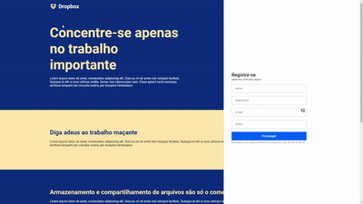

<h1 align="center">
DropboxCloneHomeUi
</h1>

  

Recriação simplificada da página home do Dropbox.

Veja em funcionamento <a href="https://rocketseat-clone-dropbox-menu.netlify.app/">aqui</a>.

## Bibliotecas e linguagens

- [x] React.js
- [x] Styled Components
- [x] TypeScript

## Inicio do Ambiente de Desenvolvimento

1. Execute `npm install` ou `yarn install`. 
2. Execute `yarn start` e acesse `http://localhost:3000`. 

## Agradecimento
Time da Rocketseat.